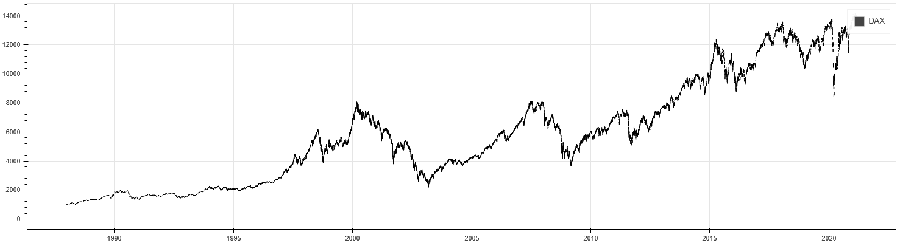

## Welcome to GitHub Pages site of msggigi's stock analysis

UNDER CONSTRUCTION!

You can use the [editor on GitHub](https://github.com/msggigi/stockanalysis/edit/gh-pages/index.md) to maintain and preview the content for your website in Markdown files.

Whenever you commit to this repository, GitHub Pages will run [Jekyll](https://jekyllrb.com/) to rebuild the pages in your site, from the content in your Markdown files.

For more details see [GitHub Flavored Markdown](https://guides.github.com/features/mastering-markdown/).

### Support or Contact

Having trouble with Pages? Check out our [documentation](https://docs.github.com/categories/github-pages-basics/) or [contact support](https://support.github.com/contact) and we’ll help you sort it out.
